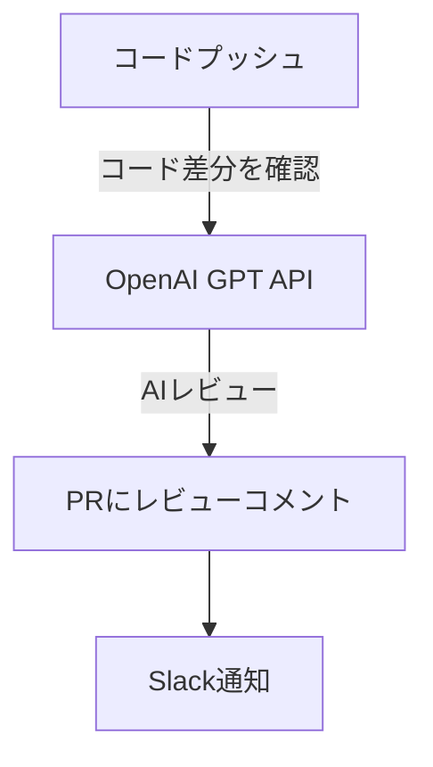
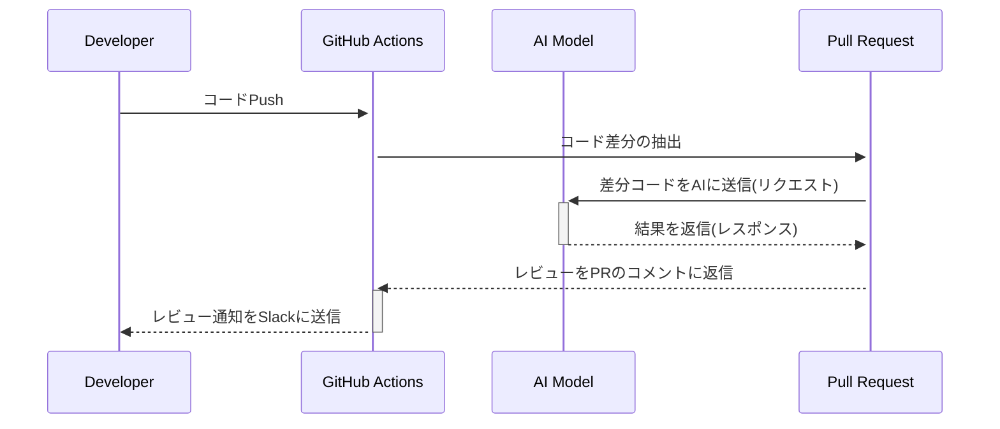

# 生成AIを使ったCIによる自動コードレビュー

## 技術構成
* ダイアグラム：Mermaid.js

## 処理フロー

```mermaid
flowchart TD

1.[コードプッシュ] --> |コード差分を確認| 2.[OpenAI GPT API]
2. --> |AIレビュー| 3.[PRにレビューコメント]
3. --> 4.[Slack通知]
```

## シーケンス図

```mermaid
sequenceDiagram
  participant Developer as Developer
  participant GitHub as GitHub Actions
  participant AI as AI Model
  participant PR as Pull Request

  Developer->>+GitHub: コードPush
  GitHub->>+PR: コード差分の抽出
  PR->>+AI: 差分コードをAIに送信(リクエスト)
  AI-->>-PR: 結果を返信(レスポンス)
  PR-->>+GitHub: レビューをPRのコメントに返信
  GitHub-->>-Developer: レビュー通知をSlackに送信

```